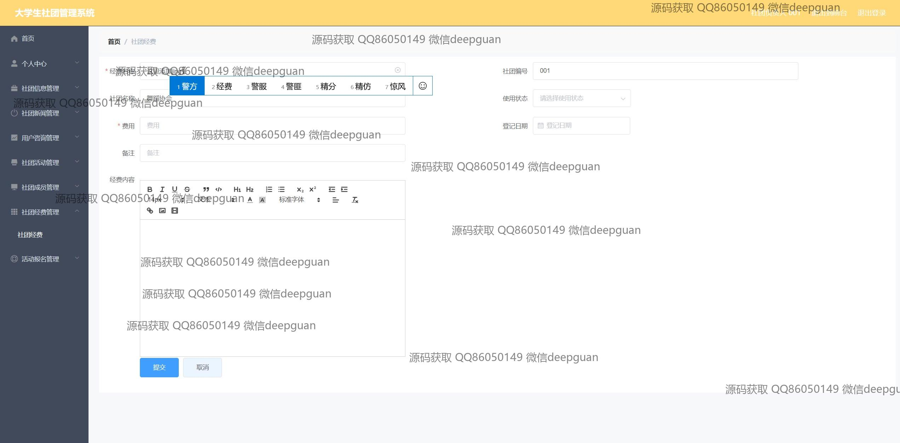

<h1 align="center">的大学生社团管理系统vue</h1>

## 简介
大学生社团管理系统：角色分为管理员、用户、社团负责人；功能包括用户管理、社团活动管理、留言反馈、经费管理、社团新闻展示。    --计算机毕业设计源码；毕设源码；java毕业设计源码

## 联系方式

<h3 align="center">获取完整代码与数据库文件 + 微信：deepguan QQ: 86050149 QQ群: 783742310</h3>

<h3 align="center">可帮忙远程部署 包运行成功！提供远程部署、修改代码、设计文档指导、代码讲解等服务！</h3>

## 功能介绍（完整见运行截图）
管理员：基本功能包括登录、注册和退出；用户管理模块，可管理用户注册信息如用户名、密码、性别、联系方式等；社团管理，可新增、修改、删除社团信息，处理社团负责人和活动信息；审核模块，用于审核社团提交的信息和活动申请；经费管理，管理社团经费的使用状态及记录。

社团负责人：负责社团信息管理，如修改社团基本信息，更新社团的活动和成员记录；使用系统提供的留言板与用户和其他负责人交流；管理社团经费，操作包括填报、编辑和查看社团经费使用情况。

用户：基本功能包括登录、注册、退出，访问个人中心查看或修改个人信息；参与并报名社团活动，查看社团新闻及相关信息；通过留言反馈模块与社团负责人或管理员沟通交流。

访客：无需注册即可浏览网站首页，查看社团信息、新闻与活动预告；使用留言功能进行咨询或反馈。

## 运行截图

本代码来源于网络,仅供学习参考使用!

